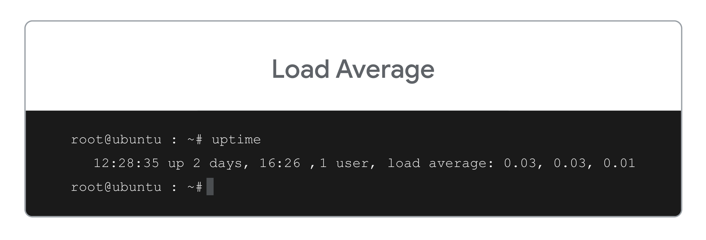
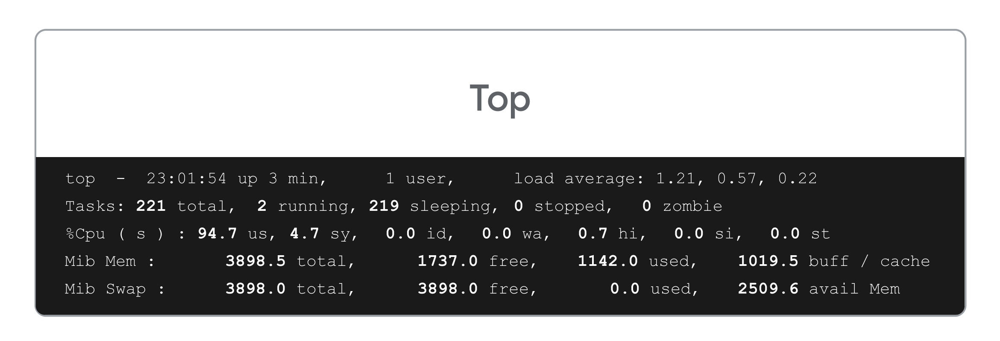

## 🐧 **Resource Monitoring in Linux**

Balancing system resources is essential for maintaining smooth computer operation. Monitoring and managing resource usage, especially **CPU load**, can help prevent performance issues. This guide explains key concepts related to **load** and **load averages** in Linux and how to monitor them effectively.

### 🧮 **Understanding Load in Linux**

In Linux, **load** refers to the total number of processes that the CPU is either **running** or **waiting to run**. 

- A **load value of 0** indicates an idle system with no processes running.
- Each additional **running or waiting process** increases the load by **1**.

For example:
- If you have **3 running processes** and **2 waiting**, the total load would be **5**.

Monitoring this load helps ensure that the system isn’t overburdened, which can lead to operating problems.

### ⏲️ **Load Average in Linux**

**Load average** provides a more useful metric by tracking load over time. It is calculated by averaging the load over **1**, **5**, and **15 minutes**. This method smooths out short-term fluctuations and provides a clearer picture of system performance.

#### **Example Load Averages**:
- **0.03 (last minute)**: CPU usage averaged **3%** over the last minute.
- **0.03 (last 5 minutes)**: CPU usage averaged **3%** over the last 5 minutes.
- **0.01 (last 15 minutes)**: CPU usage averaged **1%** over the last 15 minutes.

You can view these averages using the `uptime` command, which gives a snapshot of system performance.

### 🛠️ **Monitoring with the `top` Command**

The **`top`** command is another powerful tool to monitor the system’s load and resource usage in detail. The output is similar to the **`uptime`** command but provides more in-depth information about processes.

#### Key Metrics in `top`:

- **Total**: The sum of processes in any state.
- **Running**: Processes that are actively using the CPU.
- **Sleeping**: Processes waiting for resources.
- **Stopped**: Processes that have finished and are releasing resources.
- **Zombie**: Processes waiting for their parent to release resources (usually harmless unless too many).

By observing these metrics, IT professionals can identify which processes to terminate in order to balance system performance.

### 🚀 **Key Takeaways**

- **Load** is calculated by adding **1 for each running or waiting process**.
- Monitoring **load averages** over **1, 5, and 15 minutes** helps gauge CPU usage over time.
- The **`top`** command provides detailed insights into resource usage, allowing IT professionals to optimize system performance.
- **Balanced systems** run more smoothly, reducing the risk of operational problems caused by high resource usage.
