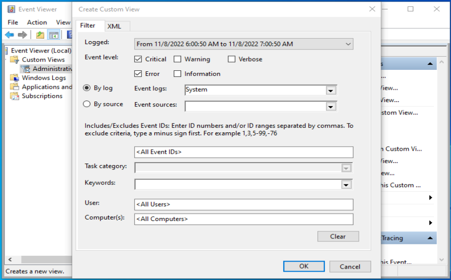

### Knowledge Summary: Windows Troubleshooting 🖥️🔍

**Windows Troubleshooting** involves using system and application logs to resolve issues like application crashes, slow boot times, application hangs, or unexpected reboots. Here’s a scientific overview:

#### **Problem Solving Process** 🛠️💡

1. **Initial Analysis**:
   - **Scope**: Determine if the issue affects one computer or all networked computers, and if it's impacting a single user or multiple users.
   - **Application Check**: Identify if the problem is related to a specific application and whether it is up-to-date.

2. **Troubleshooting Approach**:
   - **Solution Attempts**: Initial solutions might not always be correct. Iterative problem-solving helps in honing technical troubleshooting skills.
   - **Knowledge Sharing**: Educate team members about discovered issues and solutions to prevent recurrence.
   - **Documentation**: Record issues and solutions in a structured documentation system to save time and resources in the future.

#### **Log Analysis** 📊📝

- **Scenario Example**:
  - **Issue**: A software application crashes daily at the same time.
  - **Method**: Use Windows log files to investigate. Focus on system and application logs for relevant information.

- **Accessing Logs**:
  - **Tool**: Use Event Viewer, accessible via the Windows start menu or by typing `eventvwr.msc` in the run box.
  - **Custom Views**: Create a custom view in Event Viewer to filter logs by time and event type (error or critical) for specific issues.

- **Interpreting Logs**:
  - **Search Keywords**: Look for terms like "error" or the application name in the logs.
  - **Timestamps**: Compare timestamps with the occurrence of crashes to identify the root cause.
  - **Iteration**: You may need to review logs multiple times and test different solutions before finding the correct fix.

#### **Key Takeaways** 📚✨

- **Effective Troubleshooting**:
  - **Analyze**: Understand the scope and specifics of the problem.
  - **Tools**: Utilize Windows GUI tools and log analysis for resolving application errors.
  - **Communication**: Share findings with others to avoid similar issues.
  - **Documentation**: Maintain detailed records of issues and solutions for future reference.
