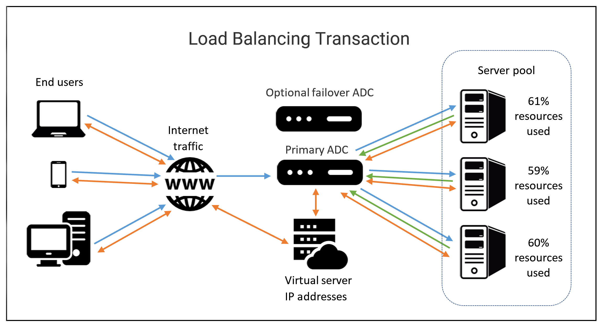

### Load Balancers: Overview and Key Concepts 🌐⚙️

#### Importance of Load Balancers 🏋️‍♂️

- **Role in Cloud Computing**: Load balancers are crucial for managing network traffic and ensuring high performance and reliability in cloud and physical environments.
- **Function**: Distribute network traffic across multiple servers to prevent overload, enhance server performance, and ensure business continuity.

#### Components and Benefits 📊

- **Types**:
  - **Hardware Load Balancers**: Physical devices like load balancing routers.
  - **Software Load Balancers**: Applications like Citrix ADC Virtual Platform.

- **Benefits**:
  - **Traffic Distribution**: Evenly distributes traffic or uses customized rules to maximize server performance.
  - **Failure Detection**: Identifies server failures and reroutes traffic to maintain high availability.
  - **Scalability**: Allows for dynamic addition or removal of servers.

#### Terminology Glossary 📚

- **Client**: A device or program that requests resources from a server (e.g., web browsers).
- **Host/Node**: A server (physical or virtual) identified by its IP address that receives network traffic.
- **Member**: A host/node receiving traffic on a specified TCP port.
- **Pool/Cluster/Farm**: A group of hosts/nodes providing similar services.
- **Application Delivery Controllers (ADC)**: Devices or software managing traffic and load balancing, also providing security and encryption.
- **Path-based Routing**: Routes traffic based on URL paths.
- **Listener**: Software that forwards client requests to target groups.
- **Open Systems Interconnection (OSI) Model**: Framework depicting seven layers of network communication (Application, Presentation, Session, Transport, Network, Data, Physical).
- **Front End**: Includes ADC and virtual servers acting as proxies for client communications.
- **Back End**: Comprises pool/cluster/farm systems and disk storage.
- **Distributed Applications**: Software running on multiple networked computers.
- **Containerization**: Deploys and runs distributed applications in isolated environments, enhancing scalability.
- **Availability Zones (AZs)**: Data centers configured for high availability.
- **Elastic Load Balancer (ELB)**: Supports multiple Availability Zones.
- **SSL/TLS**: Protocols for encrypted communication.

#### Example ADC Process 🔄

1. **Client Request**: Sent to ADC service.
2. **ADC Processing**: Analyzes request and routes it to the appropriate host/member.
3. **Host Response**: Host responds to the client via ADC.
4. **Response Forwarding**: ADC forwards response with a virtual server IP.

#### Load Balancing Types 🔍

- **Application Load Balancer**: Operates at the application layer (HTTP/HTTPS), handles traffic, security, and DDoS protection.
- **Network Load Balancer**: Functions at the transport layer (TCP/UDP), handles high volumes and supports static IP addressing.
- **Classic Load Balancer**: Operates at either application or transport layers with fixed ports.
- **Gateway Load Balancer**: Operates at the network layer (IP), routes traffic based on listener configuration.

#### Load Balancers in Cloud Environments ☁️

- **Google Cloud**:
  - Offers various load balancing solutions including global and regional options, integrated with Google Cloud Armor for DDoS protection.
  
- **Amazon Web Services (AWS)**:
  - Provides ELB solutions: Application Load Balancer, Gateway Load Balancer, and Network Load Balancer with security features like SSL/TLS decryption.

- **Microsoft Azure**:
  - Operates at the transport layer, offering public and private load balancers with zero trust security model.

#### Load Balancers in Physical Environments 🏢

- **Configuration**: Can be set up across multiple servers in data centers using systems like VMware or in smaller active-active clusters where both servers handle traffic simultaneously.

This summary covers the essentials of load balancers, their components, and their application in different environments. 🌟📈