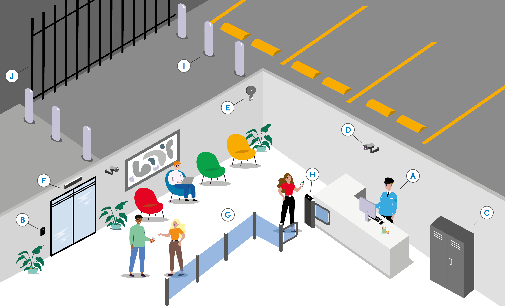

### Physical Security Measures 🛡️🔐

Physical security focuses on protecting technical assets and data from unauthorized physical access. Here are common methods used to enhance physical security:

#### **Physical Security Measures** 🏢

1. **Guards** 👮‍♂️
   - **Purpose**: Monitor controlled access points throughout a facility to prevent unauthorized access.

2. **Door Locks** 🚪🔒
   - **Purpose**: Restrict access to specific areas. Only authorized personnel with keys or security badges can unlock these doors.

3. **Equipment Locks** 🔐🖥️
   - **Purpose**: Secure sensitive equipment (servers, storage media, terminals) by anchoring them to a stationary structure. Access is controlled by keys or badges.

4. **Video Surveillance** 📹
   - **Purpose**: Continuous observation and recording of activity within controlled areas. Useful for documenting access and actions taken within these areas.

5. **Alarm Systems** 🚨
   - **Purpose**: Notify security personnel of unauthorized access by sounding alarms or sending notifications.

6. **Motion Sensors** 🚶‍♂️🔍
   - **Purpose**: Detect movement within controlled areas. Can trigger alarms or activate video surveillance systems.

#### **Protecting Entry Points** 🚪🔑

1. **Access Control Vestibules** 🚶‍♂️🚪🚪
   - **Purpose**: Create a space between two sets of interlocking doors to prevent unauthorized individuals from following authorized personnel into secure areas.

2. **Badge Readers** 📇
   - **Purpose**: Read information from plastic cards to identify users. Used to control access to doors and information systems.

#### **Protecting the Exterior** 🏠🔒

1. **Bollards** 🚧
   - **Purpose**: Short, sturdy posts used to restrict vehicle access to controlled areas.

2. **Fences** 🚧
   - **Purpose**: Physical barriers that enclose areas to establish a perimeter and deter external threats.

### Key Takeaways

- **Comprehensive Security**: Protect both physical and virtual assets to ensure comprehensive security.
- **Stay Updated**: Continuously review and adopt new physical security technologies and methods to safeguard your organization’s assets.

Regularly updating and enhancing physical security measures helps ensure the protection of technical assets and sensitive data from unauthorized physical access.