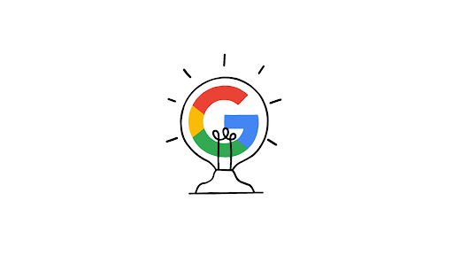

# **Google Learning Program** 📚

## Introduction 📖

Welcome to the Google Learning Program GitHub repository! This space is dedicated to storing documentation and resources related to Google's courses and certifications. It serves as a valuable resource for individuals interested in gaining knowledge and skills in technology and software development, as well as personal and professional development.

##### If you would like to get in touch, please email me at: **chunhthanhde.dev@gmail.com**

 

## Purpose 🎯

The repository provides a centralized location for exploring Google's learning programs. Whether you're a beginner or an experienced professional, you'll find educational materials to help you achieve your goals.

## Content 📚

Here are some key contents available in this repository:

- 📚 Lectures, slides, and study materials covering various topics and domains offered by Google.
- 📑 Complete text content of the courses, including detailed explanations, examples, and exercises.
- 🔍 Supplementary resources such as code samples, project templates, and reference materials to support your learning journey.

## Commitment to Academic Integrity 🎓

We believe in the importance of academic integrity and make the following commitments:

1. **No Unauthorized Sharing of Resources** 🙅‍♂️: We will not share information or solutions to homework, quizzes, exams, projects, and other assessments, except as explicitly permitted.
   
2. **Knowledge Consolidation** 🧠: This repository aims to provide a structured way to review and reinforce concepts learned throughout the certification course. The materials are intended to supplement your learning, not replace official course content or assessments.
   
3. **Respect for Course Policies** 🤝: We acknowledge and respect the Coursera Honor Code and the Google Honor Code. Any actions that violate these policies are strictly prohibited.

## Coursera and Google Honor Code Compliance 📜🌟

This repository is designed to respect both the Coursera and Google Honor Codes. It will not share solutions or answers to quizzes and tasks within the certification course. The goal is to consolidate knowledge gained from course materials to enhance the learning experience.

## Contribution Guidelines 🤝

Contributions that align with the principles of academic integrity and the Honor Codes are welcome. We encourage ideas, summaries, and other non-solution-based resources to enhance the learning experience for everyone.

### How to Contribute

1. **Fork the repository**: Create a copy of the repository under your own GitHub account.
2. **Make your changes**: Edit files or add new content as needed.
3. **Submit a Pull Request**: Once you're satisfied with your changes, submit a pull request to merge your contributions back into the main repository.

Feel free to check the repository at [Google Learning Program](https://github.com/ChunhThanhDe/Google-Learning-Program).

## Star and Feedback 🌟📝

If you find this repository useful, please consider giving it a star! Your feedback is also invaluable. If you have suggestions or questions, don't hesitate to open an issue. Your input is highly appreciated and will contribute to the continuous improvement of this repository.

[**Send a FeedBack**](https://github.com/ChunhThanhDe/Google-Learning-Program/issues/1#issuecomment-new)

<!-- Feedback -->
| Name | Date | Feedback |
|---|---|---|
|[  ChunhThanhDe](https://github.com/ChunhThanhDe)|9/21/2024, 12:24:07 PM (UTC+7)|Welcome, looking forward to receiving your Feedback! 😗😗😗|
<!-- /Feedback -->

## License 📜

This repository is licensed under the **MIT License**. Please review the license file for more information.
